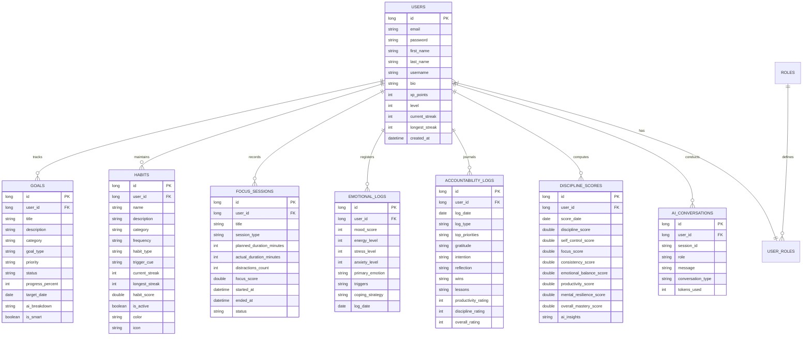

# Self-improvement - AI-Powered Behavioral Intelligence Platform

Self-improvement is an intelligent behavioral operating system designed to help users defeat procrastination, build unbreakable discipline, and transform into their best selves. Powered by neuroscience-backed principles and AI integration, the platform tracks habits, goals, focus sessions, emotional patterns, and daily accountability while offering an interactive AI life coach and decision analyst.

---

## 1. Project Overview
Most productivity tools only track *what* you do. **Self-improvement** is designed to understand *why* you do it, predict *where* you might fail, and guide you on *how* to change. It translates daily behaviors into 7 distinct behavioral scores (Discipline, Focus, Self-Control, Consistency, Emotional Balance, Productivity, and Mental Resilience) to present a comprehensive, 360-degree view of your personal development.

---

## 2. Features
* **SMART Goals Tracker:** Break down daily, short-term, or long-term goals with milestones, priorities, and progress tracking.
* **Habit Intelligence:** Build positive habits or break negative ones with streak tracking, frequency configurations, and automatic habit score calculations.
* **Focus Timer:** Log deep work sessions, Pomodoros, flow states, or dopamine detoxes with integrated distraction counters and automatic focus score logging.
* **Daily Accountability Logs:** Structured morning planning (priorities, gratitude, intentions) and nightly reflections (wins, lessons, rating scales).
* **Emotional Intelligence Log:** Monitor mood, energy, stress, and anxiety. Log triggers and notes to build emotional resilience and identify behavioral trends.
* **AI Life Coach & Decision Support:** Real-time conversations with an AI coach trained in behavioral psychology, alongside a Decision Support system that analyzes choices across 5 impact dimensions.
* **Discipline & Mastery Scores:** Visualize your progress with interactive weekly trends and self-mastery radar charts.
* **Comprehensive Reports:** Export and download weekly/monthly PDF reports, or download raw data in Excel and CSV formats.

---

## 3. Tech Stack
* **Backend:** Java 17, Spring Boot 3.2.5 (MVC, Security, Data JPA, Thymeleaf templating)
* **Frontend:** HTML5, Vanilla JavaScript, Vanilla CSS (harmonious dark theme, glassmorphism, responsive layouts, Google Fonts: Inter & JetBrains Mono, FontAwesome 6)
* **Database:** MySQL (Development), PostgreSQL (Production-ready)
* **AI Integration:** Spring WebFlux (reactive HTTP client integrated with OpenAI/Groq Llama 3 APIs)
* **Reporting Utilities:** iText 8.0.3 (PDF generation), Apache POI 5.2.5 (Excel generation)
* **Build & Containers:** Maven, Docker (multi-stage builds)

---

## 4. Project Structure
```text
SELFMASTER-AI-main/
│
├── backend/                        # Spring Boot Backend Application
│   └── src/
│       ├── main/
│       │   ├── java/com/selfmaster/
│       │   │   ├── config/         # Security and system configurations
│       │   │   ├── controller/     # REST and MVC Thymeleaf controllers
│       │   │   ├── dto/            # Data Transfer Objects (Requests/Responses)
│       │   │   ├── entity/         # JPA database entities
│       │   │   ├── exception/      # Global exception handling
│       │   │   ├── repository/     # Spring Data JPA repositories
│       │   │   ├── security/       # JWT providers and filters
│       │   │   └── service/        # Core business logic services
│       │   │
│       │   └── resources/
│       │       ├── application.properties      # Development configuration
│       │       └── application-prod.properties # Production configuration
│       └── test/                   # JUnit & Integration tests
│
├── frontend/                       # Frontend Web UI
│   ├── static/                     # Static assets
│   │   ├── css/                    # Main, component, and dashboard CSS
│   │   └── js/                     # Core App JavaScript
│   └── templates/                  # Thymeleaf HTML views & layouts
│
├── pom.xml                         # Maven build file
└── Dockerfile                      # Multi-stage Docker container specification
```

---

## 5. Database Design
The platform relies on a relational schema designed for efficient daily logs and behavioral analytics.



---

## 6. Installation

### Prerequisites
* **Java Development Kit (JDK) 17** or higher
* **Apache Maven 3.9+**
* **MySQL 8.0+** (or PostgreSQL if deploying via Docker)

### Step-by-Step Setup
1. **Clone the repository:**
   ```bash
   git clone <repository-url>
   cd self-improvement
   ```

2. **Configure the Database:**
   Create a schema named `selfimprovementdb` in your MySQL instance.
   ```sql
   CREATE DATABASE selfimprovementdb;
   ```

3. **Update Application Configurations:**
   Open [backend/src/main/resources/application.properties](file:///c:/Users/Admin1/Desktop/01/SELFMASTER-AI-main/backend/src/main/resources/application.properties) and update the database username, password, and your LLM API keys (e.g., Groq/OpenAI):
   ```properties
   spring.datasource.username=your_db_user
   spring.datasource.password=your_db_password
   app.openai.api-key=your_llm_api_key
   ```

4. **Build the Application:**
   Compile and package the JAR file using Maven:
   ```bash
   mvn clean package
   ```

5. **Run the Application:**
   Start the Spring Boot server:
   ```bash
   mvn spring-boot:run
   ```
   Open your browser and navigate to `http://localhost:8080` to access the platform.

---

## 7. Configuration
The application is configured to run out-of-the-box in development mode, but supports production profiles via environment variables:

| Configuration Key | Description | Default / Dev Value | Production Environment Variable |
| --- | --- | --- | --- |
| `spring.datasource.url` | JDBC Database Connection URL | `jdbc:mysql://localhost:3306/selfimprovementdb` | `DB_URL` |
| `app.jwt.secret` | Signing key for JWT Auth | `Self-improvement AI2024SuperSecret...` | `JWT_SECRET` |
| `app.openai.api-key` | API Key for LLM integrations | Groq API Key | `OPENAI_API_KEY` |
| `app.openai.model` | LLM Model name | `llama3-8b-8192` | — |
| `spring.mail.username` | Sender email address for SMTP | Gmail account | `MAIL_USERNAME` |
| `spring.mail.password` | SMTP App password | App password | `MAIL_PASSWORD` |

---

## 8. API Routes

### Authentication
* `POST /api/auth/register` - Registers a new user.
* `POST /api/auth/login` - Authenticates user and generates JWT.
* `POST /api/auth/forgot-password` - Initiates password reset flow.
* `POST /api/auth/reset-password` - Updates user password with valid token.

### Goals
* `GET /api/goals` - Retrieves current user's goals.
* `POST /api/goals` - Creates a new goal.
* `PUT /api/goals/{id}/progress` - Updates progress percentage of a goal.
* `DELETE /api/goals/{id}` - Deletes a goal.

### Habits
* `GET /api/habits` - Retrieves user's active habits.
* `POST /api/habits` - Creates a new habit.
* `POST /api/habits/log` - Logs a habit completion for the day.
* `DELETE /api/habits/{id}` - Deletes a habit.

### Focus Sessions
* `POST /api/focus/start` - Begins a new focus session.
* `POST /api/focus/{id}/end` - Ends a focus session, recording distractions.
* `GET /api/focus/sessions` - Retrieves focus history.

### AI Coach & Decisions
* `POST /api/ai/chat` - Sends a message to the AI Life Coach or Decision Analyst.
* `GET /api/ai/history/{sessionId}` - Fetches message history for a chat session.

### Reporting
* `GET /api/reports/weekly` - Generates and downloads a weekly PDF performance report.
* `GET /api/reports/monthly` - Generates and downloads a monthly PDF performance report.
* `GET /api/reports/export/excel` - Exports all historical scores to a `.xlsx` Excel sheet.
* `GET /api/reports/export/csv` - Exports historical scores to a `.csv` file.

---

## 10. Future Improvements
1. **Dedicated Mobile Apps:** Build native iOS and Android applications to enable push notifications for habit triggers and focus timers.
2. **Social Accountability:** Introduce cooperative challenges, group streaks, and leaderboard systems to enhance social commitments.
3. **Advanced Predictive Analytics:** Incorporate on-device machine learning models to detect procrastination patterns before they occur.
4. **Calendar Integration:** Seamlessly sync SMART goals and daily accountability windows with Google Calendar and Outlook.
5. **Offline Support:** Implement localized caching (PWA) to allow logging habits, focus sessions, and journals without internet connectivity.
